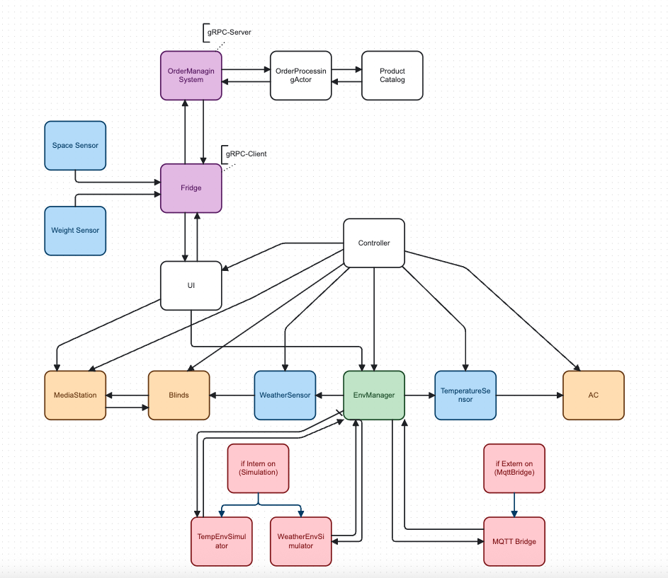

# Akka Actor Architecture Example

Dieses Repository enthält zwei Hauptservices:

1. **order-manager** – gRPC-Server für Produktbestellungen
2. **smart-home** – Smart-Home-Simulation mit Kühlschrank (Fridge) und Environment-System

---

## Commands (Smart-Home)

| Befehl            | Beschreibung                                                        | Beispiel       | Erwartete Reaktion                          |
|-------------------|----------------------------------------------------------------------|----------------|---------------------------------------------|
| `t <Wert>`        | Temperatur setzen                                                   | `t 29.5`       | AC aktiviert/deaktiviert je nach Wert       |
| `w <Zustand>`     | Wetter setzen                                                       | `w sunny`      | Blinds schließen sich bei „sunny“           |
| `internal on/off` | Internen Simulationsmodus aktivieren/deaktivieren                   | `internal on`  | Startet TempEnvSimulator & WeatherEnvSimulator |
| `external on/off` | Externen MQTT-Modus aktivieren/deaktivieren                         | `external on`  | Startet MQTT-Bridge                         |
| `film start`      | Film starten                                                        | `film start`   | MediaStation startet Film, Blinds schließen |
| `film stop`       | Film beenden                                                        | `film stop`    | Film wird gestoppt, Blinds wenden Wetterlogik an |

### Zentrale Komponenten

- **Controller**  
  Initialisiert alle Akteure (UI, EnvManager, Blinds, AC, MediaStation, etc.)
- **EnvironmentManager**  
  Verarbeitet Temperatur- und Wetterdaten (intern/extern) und verteilt sie an Sensoren
- **UI**  
  CLI/REPL zur Steuerung des Systems durch den Benutzer

### Zwei Modi

- **Internal Mode**  
  Simuliert Temperatur und Wetter über TempEnvSimulator & WeatherEnvSimulator
- **External Mode**  
  Empfängt reale Daten per MQTT via MqttBridge

### Schnittstellen

- **Sensoren**
    - `TemperatureSensor` → AC
    - `WeatherSensor` → Blinds
- **Aktuatoren**
    - Blinds, AirCondition, MediaStation

### Komponenten & Aufgaben

| Komponente           | Aufgabe                                                                          |
|----------------------|----------------------------------------------------------------------------------|
| EnvironmentManager   | Verarbeitet interne/​externe Daten und verteilt sie an Sensoren                   |
| TempEnvSimulator     | Liefert periodisch simulierte Temperaturwerte                                    |
| WeatherEnvSimulator  | Liefert periodisch simulierte Wetterbedingungen                                  |
| MqttBridge           | Empfängt reale Sensordaten von einem MQTT-Broker                                 |
| TemperatureSensor    | Leitet Temperaturen an die AC weiter                                              |
| WeatherSensor        | Leitet Wetterdaten an die Blinds weiter                                           |
| Blinds               | Öffnet/schließt sich je nach Wetter oder bei Film                                 |
| MediaStation         | Startet/stoppt Filme, steuert Blinds während Films                                |
| AC (AirCondition)    | Aktiviert sich bei Temperaturen > 25 °C                                           |

### Verhalten & Regeln

- Blinds schließen sich bei „sunny“, öffnen sich bei anderem Wetter (außer Film läuft)
- Film aktiv: Blinds werden stets geschlossen
- AC aktiviert sich bei Temperatur > 25 °C
- Moduswechsel (intern/extern) jederzeit möglich
- Nach Filmende übernehmen Blinds wieder Wetterlogik

---

## Commands (Fridge)

| Befehl                       | Beschreibung                                    | Beispiel          | Erwartete Reaktion                                   |
|------------------------------|--------------------------------------------------|-------------------|------------------------------------------------------|
| `consume <Produkt> <Anzahl>` | Verbraucht X Stück eines Produkts                | `consume milk 2`  | Inventar um 2× „milk“ reduziert                      |
| `order <Produkt> <Anzahl>`   | Bestellt per gRPC beim Order-Manager             | `order eggs 6`    | Sendet Bestellauftrag, Receipt wird ausgegeben       |
| `inventory`                  | Zeigt aktuellen Bestandsstand                    | `inventory`       | Listet alle Produkte mit Stückzahl auf               |
| `weight`                     | Zeigt Gesamtgewicht aller Produkte (in kg)       | `weight`          | „Aktuelles Gewicht: 3.20 kg“                         |
| `space`                      | Zeigt belegte und verfügbare Slots im Kühlschrank| `space`           | „Belegte Slots: 12 / MaxSlots: 20“                   |

### Zentrale Komponenten

- **UI**  
  CLI/REPL für Fridge-Befehle
- **Fridge**  
  Prozessiert Verbrauch, Bestellungen und Sensor-Updates
- **WeightSensor & SpaceSensor**  
  Liefern regelmäßig Gewicht und belegte Slots
- **OrderServiceClient**  
  gRPC-Client, verbindet sich mit `order-manager`

### Verhalten & Regeln

1. **Kapazitäts-Check (Slots)**  
   Bestellungen nur, wenn `usedSlots + amount ≤ maxSlots`
2. **Gewichts-Check**  
   Bestellungen nur, wenn `totalWeight + amount×productWeight ≤ maxWeight`
3. **Auto-Reorder**  
   Fridge löst `OrderProduct` selbst aus, sobald Bestand eines Produkts auf 0 sinkt
4. **gRPC-Kommunikation**
    - Umgebungsvariablen:
        - `ORDER_MANAGER_HOST` (Standard: `order-manager`)
        - `ORDER_MANAGER_PORT` (Standard: `50051`)
5. **Produktpreise**  
   Werden vom `order-manager` über gRPC erfragt

---

## Deployment mit Docker Compose

```bash
# 1) Order-Manager bauen & starten
docker build -t order-manager:latest ./order-manager
docker compose up -d order-manager

# 2) Smart-Home interaktiv starten
docker build -t smart-home:latest ./smart-home
docker run -it \
  --name smart-home-interactive \
  --network <COMPOSE_NETWORK> \
  -e ORDER_MANAGER_HOST=order-manager \
  -e ORDER_MANAGER_PORT=50051 \
  smart-home:latest
```

## UML Diagram des Systems
